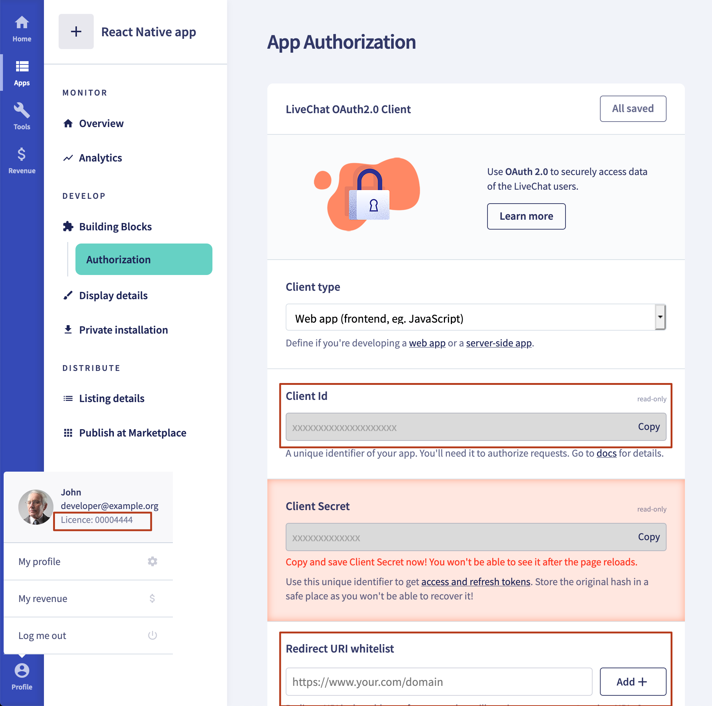

# LiveChat for React Native

This is a React Native component to easily add [LiveChat widget](https://www.livechatinc.com/) to your application.

It works for both iOS and Android.


## Getting Started

### Prerequisites

To use LiveChat in your React application, you will need the LiveChat license ID.

To obtain authorization data (redirect_uri and client_id), you need to create a new LiveChat app. See our [Creating LiveChat apps](https://developers.livechatinc.com/docs/getting-started/guides/#creating-livechat-apps) documentation.

- `client_id` - identifies the application, you will receive it after creating a new application in [Developer Console](https://developers.livechatinc.com/console/apps)
- `redirect_uri` - it must be one of the URLs that you entered when creating the new app in the [Developer Console](https://developers.livechatinc.com/console/apps)



If you don't have an account, you can create one [here](https://www.livechatinc.com/).

### Installation

To import LiveChat for React Native, run the following command to install required dependency (react-native-webview) and react-native-livechat library:

```javascript
npm install react-native-webview react-native-livechat --save
```

### Supported LiveChat features

- chatting
- sneak-peek
- rich messages: single cards with images, title, subtitle and quick replies
- agent's attachments
- system messages

### Unsupported LiveChat features

- pre-chat and post-chat forms
- rating
- transcript
- ticket forms
- queues
- translations
- card masking
- chat boosters
- customer's attachments
- sound notfifications
- updating customer info

If you would like to use unsupported features in your React Native app, read about the Alternative React Native installation method.

### Alternative React Native installation method

This project implements basic LiveChat features using React Native technology. If you need to use more advanced LiveChat features, you can use Webview to embed web LiveChat widget using a direct chat link.

To do it, use `react-native-webview` library and add `Webview` component with your licenses direct chat link, replacing `<LICENSE_ID>` string with you LiveChat's license id.

```javascript
<WebView
  source={{
    uri: 'https://secure.livechatinc.com/licence/<LICENSE_ID>/v2/open_chat.cgi',
  }}
/>
```

## User Guide

### Start

Having imported LiveChat for React Native, put it in your render method:

```javascript
import LiveChat from 'react-native-livechat'

...

<LiveChat license="<LICENSE_ID>" redirectUri="https://example.org" clientId="<APP_CLIENT_ID>" />
```

You can also pass 'group' as a prop, to assign chat to chosen LiveChat group.

```javascript
<LiveChat
  group={2}
  license="<LICENSE_ID>"
  redirectUri="https://example.org"
  clientId="<APP_CLIENT_ID>"
/>
```

### Customization

#### Chat bubble

The chat bubble is the round icon (chat trigger) in the bottom right corner of the screen.

##### Position

You can control the position of the bubble with `bubbleStyles` prop:

```javascript
const styles = StyleSheet.create({
  bubbleStyles: {
    position: 'absolute',
    left: 24,
    bottom: 24,
  },
})

;<LiveChat
  license="<LICENSE_ID>"
  redirectUri="https://example.org"
  clientId="<APP_CLIENT_ID>"
  bubbleStyles={styles.bubbleStyles}
/>
```

##### Color

You can change the color of the bubble by passing `bubbleColor` prop:

```javascript
<LiveChat
  bubbleColor="red"
  license="<LICENSE_ID>"
  redirectUri="https://example.org"
  clientId="<APP_CLIENT_ID>"
/>
```

##### Custom bubble

If you don't like the default bubble, you can send `bubble` prop with your own component:

```javascript
<LiveChat
  license="<LICENSE_ID>"
  redirectUri="https://example.org"
  clientId="<APP_CLIENT_ID>"
  bubble={<View style={{ width: 60, height: 60, backgroundColor: 'green' }} />}
/>
```

#### Chat widget

This module uses [react-native-gifted-chat](https://github.com/FaridSafi/react-native-gifted-chat) for chat UI.

You can customise your chat widget by sending props to LiveChat component (like you would normally do with GiftedChat component).

For example, if you want `onPressAvatar` to show agent's details, you can do it like this:

```javascript
<LiveChat license="<LICENSE_ID>" onPressAvatar={(info) => console.warn(info)} />
```

You can find all props in the official [react-native-gifted-chat documentation](https://github.com/FaridSafi/react-native-gifted-chat).

## Support

If you need any help, you can chat with us [here](https://livechatinc.com/).

I hope you will find this module useful. Happy coding!
